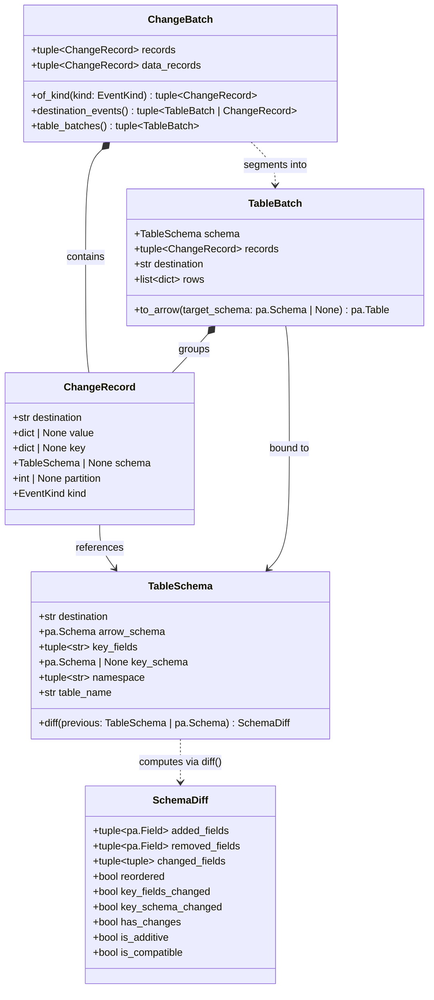

# Domain Models & Data Types

This page documents the public domain entities in `pydbzengine.schema.models` (re-exported from `pydbzengine.schema`) and the compiler data type handlers in `pydbzengine.schema.handlers`, `pydbzengine.schema.temporal`, and `pydbzengine.schema.registry`.

## Domain Model Relationships

```mermaid
classDiagram
    class ChangeBatch {
        +tuple~ChangeRecord~ records
        +tuple~ChangeRecord~ data_records
        +of_kind(kind: EventKind) tuple~ChangeRecord~
        +destination_events() tuple~TableBatch | ChangeRecord~
        +table_batches() tuple~TableBatch~
    }

    class TableBatch {
        +TableSchema schema
        +tuple~ChangeRecord~ records
        +str destination
        +list~dict~ rows
        +to_arrow(target_schema: pa.Schema | None) pa.Table
    }

    class ChangeRecord {
        +str destination
        +dict | None value
        +dict | None key
        +TableSchema | None schema
        +int | None partition
        +EventKind kind
    }

    class TableSchema {
        +str destination
        +pa.Schema arrow_schema
        +tuple~str~ key_fields
        +pa.Schema | None key_schema
        +tuple~str~ namespace
        +str table_name
        +diff(previous: TableSchema | pa.Schema) SchemaDiff
    }

    class SchemaDiff {
        +tuple~pa.Field~ added_fields
        +tuple~pa.Field~ removed_fields
        +tuple~tuple~ changed_fields
        +bool reordered
        +bool key_fields_changed
        +bool key_schema_changed
        +bool has_changes
        +bool is_additive
        +bool is_compatible
    }

    ChangeBatch *-- ChangeRecord : contains
    ChangeBatch ..> TableBatch : segments into
    TableBatch *-- ChangeRecord : groups
    TableBatch --> TableSchema : bound to
    ChangeRecord --> TableSchema : references
    TableSchema ..> SchemaDiff : computes via diff()
```

---

## Domain Entities (`pydbzengine.schema.models`)

### `TableSchema`
Immutable compiled schema descriptor for a CDC destination:

| Attribute / Method | Type | Description |
| :--- | :--- | :--- |
| `destination` | `str` | Full destination identifier (e.g., `"cdc_prod.inventory.orders"`). Whitespace-trimmed and non-empty. |
| `arrow_schema` | `pa.Schema` | Compiled PyArrow schema matching the exact top-level event value emitted by Debezium (envelope struct by default, or flat table columns when using `ExtractNewRecordState`). |
| `key_fields` | `tuple[str, ...]` | Field names extracted from the event key schema (e.g., `("id",)` for struct keys, `("key",)` for scalar keys, or `()` for keyless / map-keyed tables). |
| `key_schema` | `pa.Schema \| None` | Compiled PyArrow schema of the event key, if present (non-map keys). |
| `namespace` | `tuple[str, ...]` | Dot-split destination prefix excluding `table_name` (e.g., `("cdc_prod", "inventory")`). |
| `table_name` | `str` | Table name extracted from the final dot-separated segment of `destination` (e.g., `"orders"`). |
| `diff(previous)` | `SchemaDiff` | Computes the structural difference from `previous` (`TableSchema` or `pa.Schema`) to `self`. |

### `SchemaDiff`
Structural comparison result between a previous and new `TableSchema` (or `pa.Schema`):

| Attribute / Property | Type | Description |
| :--- | :--- | :--- |
| `added_fields` | `tuple[pa.Field, ...]` | Top-level fields added in the new schema. |
| `removed_fields` | `tuple[pa.Field, ...]` | Top-level fields present in the previous schema that were removed. |
| `changed_fields` | `tuple[tuple[pa.Field, pa.Field], ...]` | `(old_field, new_field)` pairs whose `pa.DataType` or `nullable` flag changed. |
| `reordered` | `bool` | `True` if the relative order of surviving top-level fields changed. |
| `key_fields_changed` | `bool` | `True` if `TableSchema.key_fields` changed (always `False` when diffing against a raw `pa.Schema`). |
| `key_schema_changed` | `bool` | `True` if `TableSchema.key_schema` changed (always `False` when diffing against a raw `pa.Schema`). |
| `has_changes` | `bool` | `True` if any fields were added, removed, changed, reordered, or if key metadata changed. |
| `is_additive` | `bool` | `True` when there are no removals, reordering, or key changes, at least one addition occurred, all top-level added fields are nullable, and any changed field is a purely additive nested struct evolution (preserving subfield order and adding only nullable subfields). Recognizes new nullable columns inside Debezium envelope `before`/`after` structs as additive. |
| `is_compatible` | `bool` | `True` when no fields were removed, key metadata is unchanged, no non-nullable fields were added (top-level or nested inside structs/lists/maps), no lossy promotions occurred (`int64`/`uint64`/`decimal` to float), and PyArrow permissive schema unification matches the new schema (supports lossless widenings such as `int32 -> int64`, `float32 -> float64`, decimal precision/scale widening, temporal unit widening, nullability widening, column reordering, and compatible nested struct evolution). |

### `ChangeRecord` & `EventKind`
`ChangeRecord` represents a single converted CDC event:

| Attribute | Type | Description |
| :--- | :--- | :--- |
| `destination` | `str` | Destination topic or table identifier. |
| `value` | `dict[str, Any] \| None` | Converted payload dictionary matching `schema.arrow_schema`, or `None` exclusively for `EventKind.TOMBSTONE`. |
| `key` | `dict[str, Any] \| None` | Converted key dictionary (required and non-empty for `EventKind.TOMBSTONE`). |
| `schema` | `TableSchema \| None` | Compiled `TableSchema` for the event, if available. |
| `partition` | `int \| None` | Source partition number, if present. |
| `kind` | `EventKind` | Event classification: `DATA`, `HEARTBEAT`, `SCHEMA_CHANGE`, or `TOMBSTONE`. |

`EventKind.classify(destination, field_names, heartbeat_prefix, *, schema_name=None)` classifies each event deterministically:

- **`EventKind.TOMBSTONE`** (`"tombstone"`): `value` is `None` (delete tombstone carrying only `key`).
- **`EventKind.HEARTBEAT`** (`"heartbeat"`): Destination starts with `heartbeat_prefix` or wire schema ends with `io.debezium.connector.common.Heartbeat`.
- **`EventKind.SCHEMA_CHANGE`** (`"schema_change"`): Wire schema ends with `.SchemaChangeValue` / `.SchemaChangeKey`, or payload contains Debezium DDL marker fields (`{"ddl", "databaseName", "tableChanges"}`).
- **`EventKind.DATA`** (`"data"`): Standard table change record.

In default Debezium envelope mode, access fields directly on `record.value` (for example, `record.value["op"]`, `record.value["before"]`, `record.value["after"]`, `record.value["source"]`). When `ExtractNewRecordState` is configured, `record.value` contains the unwrapped table columns (plus any configured metadata fields like `record.value["__op"]`) directly at the top level.

### `TableBatch` & `ChangeBatch`
- **`ChangeBatch`**: Holds `records: tuple[ChangeRecord, ...]` in arrival order (supports `len()` and iteration).
  - `batch.of_kind(kind: EventKind) -> tuple[ChangeRecord, ...]`: Filters records by `EventKind` in arrival order.
  - `batch.data_records -> tuple[ChangeRecord, ...]`: Shorthand for `batch.of_kind(EventKind.DATA)`.
  - `batch.destination_events() -> tuple[TableBatch | ChangeRecord, ...]`: Segments records into causally ordered per-destination `TableBatch` runs and lifecycle `ChangeRecord` items (`TOMBSTONE`, `SCHEMA_CHANGE`, `HEARTBEAT`). Flushes a destination's open run on `TableSchema` change or tombstone, flushes all open destinations on `SCHEMA_CHANGE` barriers, and emits heartbeats after data/DDL events.
  - `batch.table_batches() -> tuple[TableBatch, ...]`: Returns only the homogeneous `TableBatch` runs from `destination_events()`.
- **`TableBatch`**: Groups consecutive `EventKind.DATA` records for one destination sharing a single `TableSchema` (supports `len()` and iteration).
  - `batch.destination -> str`: Shortcut for `batch.schema.destination`.
  - `batch.rows -> list[dict[str, Any]]`: Converted `record.value` dictionaries matching `schema.arrow_schema`.
  - `batch.to_arrow(target_schema: pa.Schema | None = None) -> pa.Table`: Materializes a `pyarrow.Table` from `batch.rows` using `schema.arrow_schema`. When `target_schema` is provided and differs from `schema.arrow_schema`, `to_arrow()` aligns/reorders top-level columns, casts existing columns via PyArrow (including temporal unit scaling and, with `pyarrow>=19.0.0`, nested struct evolution on `before`/`after` fields for nullable subfield additions, drops, and widenings preserving surviving subfield order; subfield reordering requires `pyarrow>=21.0.0`), fills missing nullable target columns with nulls, and recursively validates target nullability across top-level columns, structs, lists, and maps.

---

## Compiler Internals & Data Type Handlers

`TypeRegistry` (`pydbzengine.schema.registry`) compiles `FieldSpec` trees (`pydbzengine.schema.spec`) into `SchemaField` objects pairing field metadata (`doc`, `debezium.logical_type`) with one of 13 concrete `DataTypeHandler` classes across `pydbzengine.schema.handlers` and `pydbzengine.schema.temporal`:

| Handler Class | Module | Debezium / Connect Types & Logical Names | Target PyArrow Type (`pa.DataType`) | Python Runtime Value |
| :--- | :--- | :--- | :--- | :--- |
| **`BooleanTypeHandler`** | `handlers` | `boolean` | `pa.bool_()` | `bool` |
| **`IntTypeHandler`** | `handlers` | `int8`, `int16`, `int32`, `int64` (and int-backed logical types such as `Year`, `MicroDuration`, `NanoDuration`) | `pa.int8()`, `pa.int16()`, `pa.int32()`, `pa.int64()` | `int` |
| **`FloatTypeHandler`** | `handlers` | `float` / `float32`, `double` / `float64` | `pa.float32()`, `pa.float64()` | `float` |
| **`StringTypeHandler`** | `handlers` | `string` (and string-backed logical types such as `Uuid`, `Json`, `Xml`, `Enum`, `EnumSet`, `Ltree`, `Interval`) | `pa.string()` | `str` |
| **`BinaryTypeHandler`** | `handlers` | `bytes` (and `io.debezium.data.Bits`) | `pa.binary()` | `bytes` |
| **`DecimalTypeHandler`** | `handlers` | `org.apache.kafka.connect.data.Decimal` | `pa.decimal128(precision, scale)` | `decimal.Decimal` |
| **`VariableScaleDecimalHandler`** | `handlers` | `io.debezium.data.VariableScaleDecimal` | `pa.decimal128(precision, scale)` | `decimal.Decimal \| None` |
| **`DateTypeHandler`** | `temporal` | `org.apache.kafka.connect.data.Date`, `io.debezium.time.Date`, `io.debezium.time.IsoDate` | `pa.date32()` | `datetime.date \| int` |
| **`TimeTypeHandler`** | `temporal` | `org.apache.kafka.connect.data.Time`, `io.debezium.time.Time` (`ms`), `MicroTime` / `IsoTime` / `ZonedTime` (`us`), `NanoTime` (`ns`) | `pa.time32("ms")`, `pa.time64("us")`, `pa.time64("ns")` | `datetime.time \| int` |
| **`TimestampTypeHandler`** | `temporal` | `org.apache.kafka.connect.data.Timestamp`, `io.debezium.time.Timestamp` (`ms`), `MicroTimestamp` / `IsoTimestamp` (`us`), `NanoTimestamp` (`ns`), `ZonedTimestamp` (`us`, `tz="UTC"`) | `pa.timestamp(unit, tz=None \| "UTC")` | `datetime.datetime \| int` |
| **`StructTypeHandler`** | `handlers` | `struct` (envelopes, nested records, and struct-backed logical types such as `Geometry`, `Geography`, `Point`, `SparseDoubleVector`) | `pa.struct([...])` | `dict[str, Any]` |
| **`ArrayTypeHandler`** | `handlers` | `array` (lists and array-backed logical types such as `FloatVector`, `DoubleVector`) | `pa.list_(item_field)` | `list[Any]` |
| **`MapTypeHandler`** | `handlers` | `map` (maps and `io.debezium.data.Hstore`) | `pa.map_(key_field, value_field)` | `dict[Any, Any]` |

!!! tip "Preserving Debezium Logical Type Metadata"
    Logical types whose wire representation already matches a standard primitive or nested container (such as `io.debezium.data.Uuid`, `io.debezium.data.Json`, `io.debezium.data.geometry.Geometry`, `io.debezium.data.geometry.Point`, `io.debezium.data.vector.FloatVector`, and `io.debezium.data.Hstore`) compile cleanly through the corresponding standard handler while preserving their full Debezium logical type name in `pa.Field.metadata[b"debezium.logical_type"]`.
